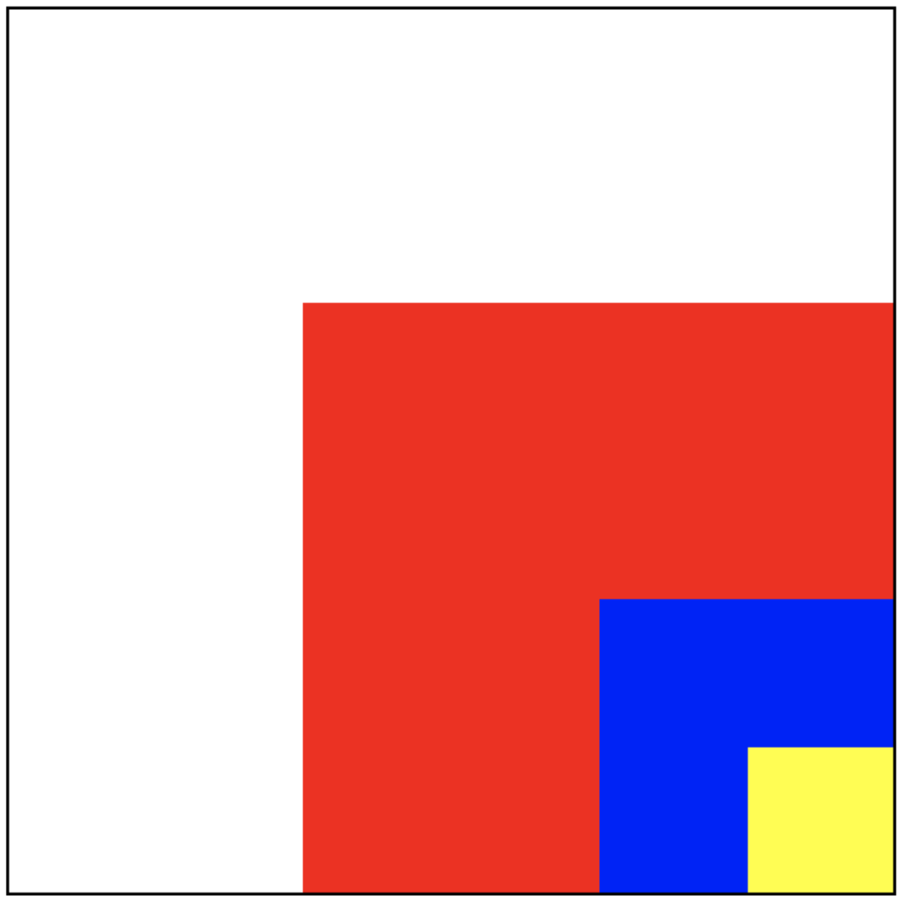
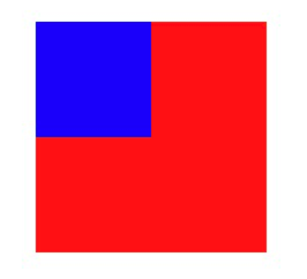

# iOS 中的事件传递和响应者链


事件的生命周期大概为三个阶段：
1. 事件的产生
2. 事件的传递
3. 事件的响应

## 事件的产生
苹果注册了一个 Source1 (基于 mach port 的) 用来接收系统事件，其回调函数为 __IOHIDEventSystemClientQueueCallback()。

当一个硬件事件(触摸/锁屏/摇晃等)发生后，首先由 IOKit.framework 生成一个 IOHIDEvent 事件并由 SpringBoard 接收。这个过程的详细情况可以参考[这里](https://iphonedev.wiki/index.php/IOHIDFamily)。SpringBoard 只接收按键(锁屏/静音等)，触摸，加速，接近传感器等几种 Event，随后用 mach port 转发给需要的App进程。随后苹果注册的那个 Source1 就会触发回调，并调用 _UIApplicationHandleEventQueue() 进行应用内部的分发。

_UIApplicationHandleEventQueue() 会把 IOHIDEvent 处理并包装成 UIEvent 进行处理或分发，其中包括识别 UIGesture/处理屏幕旋转/发送给 UIWindow 等。通常事件比如 UIButton 点击、touchesBegin/Move/End/Cancel 事件都是在这个回调中完成的。

## 事件的分类
iOS中的事件可以分为3大类型：
- 触摸事件
- 加速计事件
- 远程控制事件

这里是关注触摸事件。

在iOS中，并不是任何对象都能处理事件，只有继承了UIResponder的对象才能接受并处理事件，比如：
- UIApplication
- UIViewController
- UIView

在UIResponder中提供了以下方法来处理触摸事件：

```objc
- (void)touchesBegan:(NSSet *)touches withEvent:(UIEvent *)event;
- (void)touchesMoved:(NSSet *)touches withEvent:(UIEvent *)event;
- (void)touchesEnded:(NSSet *)touches withEvent:(UIEvent *)event;
- (void)touchesCancelled:(NSSet *)touches withEvent:(UIEvent *)event;
```

对于触摸事件，iOS中提供了UITouch对象对象，其作为用：
- 保存着跟手指相关的信息，比如触摸的位置、时间、阶段
- 当手指移动时，系统会更新同一个UITouch对象，使之能够一直保存该手指在的触摸位置
- 当手指离开屏幕时，系统会销毁相应的UITouch对象

比如在UIView的几个touch方法中，就是将UITouch作为参数传递进去的：

```objc
- (void)touchesBegan:(NSSet *)touches withEvent:(UIEvent *)event

- (void)touchesMoved:(NSSet *)touches withEvent:(UIEvent *)event

- (void)touchesEnded:(NSSet *)touches withEvent:(UIEvent *)event


- (void)touchesCancelled:(NSSet *)touches withEvent:(UIEvent *)event
```

UITouch的产生为：

当用户用一根手指触摸屏幕时，会创建一个与手指相关的UITouch对象，并且一根手指对应一个UITouch对象。如果两根手指同时触摸一个view，那么view只会调用一次touchesBegan:withEvent:方法，touches参数中装着2个UITouch对象；如果这两根手指一前一后分开触摸同一个view，那么view会分别调用2次touchesBegan:withEvent:方法，并且每次调用时的touches参数中只包含一个UITouch对象。

## 事件的传递
- 发生触摸事件后，系统会将该事件加入到一个由UIApplication管理的事件队列中。
- 然后UIApplication会从事件队列中取出最前面的事件，并将事件分发下去以便处理，通常，先发送事件给应用程序的主窗口（keyWindow）。
- 主窗口keyWindow会在视图层次结构中找到一个最合适的视图来处理触摸事件，这也是整个事件处理过程的第一步。
  
找到合适的视图控件后，就会调用视图控件的touches方法来作具体的事件处理。

也就是说，触摸事件的传递是从父控件传递到子控件，即UIApplication->window->寻找处理事件最合适的view的一个过程。

### 寻找合适的控件来处理事件

1. 首先判断主窗口（keyWindow）自己是否能接受触摸事件
2. 判断触摸点是否在自己身上
3. 子控件数组中从后往前遍历子控件，重复前面的两个步骤
4. 找到view，比如叫做fitView，那么会把这个事件交给这个fitView，再遍历这个fitView的子控件，直至没有更合适的view为止。
5. 如果没有符合条件的子控件，那么就认为自己最合适处理这个事件。

比如下面的四个View：白色、红色、蓝色、黄色，其中白色view是UIViewController的view，点击黄色view事件的传递过程为：

UIApplication -> UIWindow -> 白色view（UIViewController的view） -> 红色view -> 蓝色view -> 黄色view



找到合适的控件依赖于`hitTest:withEvent:`和`pointInside:withEvent:`两个方法：

```objc
// recursively calls -pointInside:withEvent:. point is in the receiver's coordinate system
- (nullable UIView *)hitTest:(CGPoint)point withEvent:(nullable UIEvent *)event;

// default returns YES if point is in bounds
- (BOOL)pointInside:(CGPoint)point withEvent:(nullable UIEvent *)event;   

```

#### `hitTest:withEvent:` 方法

- 作用：寻找并返回最合适的view。
- 调用时机：只要事件一传递给一个控件,这个控件就会调用他自己的hitTest：withEvent：方法。不管这个控件能不能处理事件，也不管触摸点在不在这个控件上，事件都会先传递给这个控件，随后再调用hitTest:withEvent:方法


```objc
- (UIView *)hitTest:(CGPoint)point withEvent:(UIEvent *)event{
    // 1. 判断能否接收事件
    if (self.userInteractionEnabled == NO || self.hidden == YES ||  self.alpha <= 0.01) return nil;
    
    // 2. 判断触摸点是否在自身上
    if ([self pointInside:point withEvent:event] == NO) return nil;
    
    // 3. 从后往前遍历子控件数组
    for (int i = (int)self.subviews.count - 1; i >= 0; i--)     {
        UIView *childView = self.subviews[i];
        // 坐标系的转换, 把窗口上的点转换为子控件上的点
        CGPoint childP = [self convertPoint:point toView:childView];
        UIView *fitView = [childView hitTest:childP withEvent:event];
        if (fitView) { // 如果能找到最合适的view
            return fitView;
        }
    }
    
    // 4. 没有找到更合适的view，自己作为最合适处理这个事件的view。
    return self;
}

```


#### `pointInside:withEvent:` 方法

`pointInside:withEvent:`方法判断点在不在当前view上（方法调用者的坐标系上）如果返回YES，代表点在方法调用者的坐标系上;返回NO代表点不在方法调用者的坐标系上，那么方法调用者也就不能处理事件。

## 事件的响应
事件从UIApplication->UIWindow->寻找处理事件最合适的view传递后，就会调用控件的touches方法来作具体的事件处touchesBegan…touchesMoved…touchedEnded…等。touches 方法就是对事件的响应，事件的响应是顺着响应链向上传递的，这个传递是依赖于UIResponder的nextResponder：

- UIView ：如果view是VC的root view，则它的nextResponder是 VC；否则是父view
- UIViewController ：如果 vc 是window的root vc，则它的nextResponder是 window，否则是父vc
- UIWindow：它的nextResponder是UIApplication
- UIApplication ：它的nextResponder是app delegate。

所以整个事件在找到合适的view之后，判断当前view是否能处理这个事件，如果不能，则顺着nextResponder向父view传递，如果传递到VC也不能处理这个事件，则继续传递到UIWindow，如果window对象也不处理，则其将事件或消息传递给UIApplication对象，如果UIApplication也不能处理该事件或消息，则将其丢弃。其中任何一环能处理事件，则进行时间处理，整个事件的传递就结束了。


## 总结

事件处理的整个流程总结：

  1. 触摸屏幕产生触摸事件后，触摸事件会被添加到由UIApplication管理的事件队列中（即，首先接收到事件的是UIApplication）。
  2. UIApplication会从事件队列中取出最前面的事件，把事件传递给应用程序的主窗口（keyWindow）。
  3. key window会在视图层次结构中找到一个最合适的视图来处理触摸事件。（至此，第一步已完成)
  4. 最合适的view会调用自己的touches方法处理事件
  5. touches默认做法是把事件顺着响应者链条向上抛，即顺着nextResponder向上传递。

事件的传递和响应的区别：   
事件的传递是从上到下（父控件到子控件），事件的响应是从下到上（顺着响应者链条向上传递：子控件到父控件。

# 应用
## 1. 扩大按钮的响应区域

`pointInside:withEvent:`方法可以判断事件的点是否在当前view上，则可以重写该方法，扩大响应区域。有两种方式：

1. 继承自 UIButton 重写该方法
2. 使用分类，在分类中重写该方法。（不建议，因为分类会覆盖本类的实现）

代码可参考
- 继承：[EnlargeButton](https://gist.github.com/liumenghua/568e99957ff0ca226040751e14cff9d0)
- 分类：[UIButton+Enlarge](https://gist.github.com/liumenghua/8d12460b933481bb4c333eac04997073)


另外，不建议重写`hitTest:withEvent:`，因为会阻断事件的传递，比如上面的代码改成这样，并且把红色的button扩大较大的热区，则蓝色的button就不能响应事件：

```objc
- (UIView *)hitTest:(CGPoint)point withEvent:(UIEvent *)event {
    CGRect rect = [self enlargedRect];
    if (CGRectContainsPoint(rect, point)) {
        return self;
    }
    return nil;
}
```



## 2. 自定事件响应机制

1.有一个viewA，viewA有一个subView叫做viewB，要求触摸viewB时,viewB会响应事件，而触摸viewA本身，不会响应该事件。如何实现？

在父View，即viewA中的hitTest:方法中，将自己从合适的view中去除：

```objc
- (UIView *)hitTest:(CGPoint)point withEvent:(UIEvent *)event{
    UIView *view = [super hitTest:point withEvent:event];
    if (view == self) {
        return nil;
    }
    return view;
}
```

2.一个事件多个对象处理

利用 touchs 方法，自己先响应事件，再向上传递

```objc
- (void)touchesBegan:(NSSet *)touches withEvent:(UIEvent *)event{ 
    // 1.自己先处理事件...
    NSLog(@"do somthing...");

    // 2.再调用系统的默认做法，再把事件交给上一个响应者处理
    [super touchesBegan:touches withEvent:event]; 
}

```

# UIView 哪些情况下不能接收触摸事件?

有三种情况：
- `userInteractionEnabled` 为 `NO`
- 隐藏，即 `hidden` 为 `YES`
- `alpha <= 0.01`

# 扩大按钮响应区域的方法有哪些？

1. 在 button 上面盖一个蒙层，用蒙层做事件响应

2. 重写 UIButton 的 `pointInside:withEvent:` 方法，扩大响应区域，或者重写`hitTest:withEvent:`，但不建议，以为会阻断事件的传递。具体见[iOS 中的事件传递和响应者链](./102_ans_ch_2_uikit_10.md)

# 手势冲突如何处理？ 

1.修改响应优先级

UIGestureRecognizer类中有两个方法

```objc
// 让自身这个手势事件响应优先级低于其它手势事件
// 只是在对于比它响应优先级低的手势调用
- (BOOL)gestureRecognizer:(UIGestureRecognizer *)gestureRecognizer shouldBeRequiredToFailByGestureRecognizer:(UIGestureRecognizer *)otherGestureRecognizer  {
    return YES;
}

// 让自身这个手势事件响应优先级高于其它手势事件
// 只是在对于比它响应优先级高的手势调用
- (BOOL)gestureRecognizer:(UIGestureRecognizer *)gestureRecognizer shouldRequireFailureOfGestureRecognizer:(UIGestureRecognizer *)otherGestureRecognizer {
    return YES;
}
```

2.同时响应

```objc
// 共存  A手势或者B手势 代理方法里shouldRecognizeSimultaneouslyWithGestureRecognizer   有一个是返回YES，就能共存
- (BOOL)gestureRecognizer:(UIGestureRecognizer *)gestureRecognizer shouldRecognizeSimultaneouslyWithGestureRecognizer:(UIGestureRecognizer *)otherGestureRecognizer {
    return YES;
}
```

# 参考

- [Using Responders and the Responder Chain to Handle Events](https://developer.apple.com/documentation/uikit/touches_presses_and_gestures/using_responders_and_the_responder_chain_to_handle_events?language=objc)
- [史上最详细的iOS之事件的传递和响应机制-原理篇](https://www.jianshu.com/p/2e074db792ba)