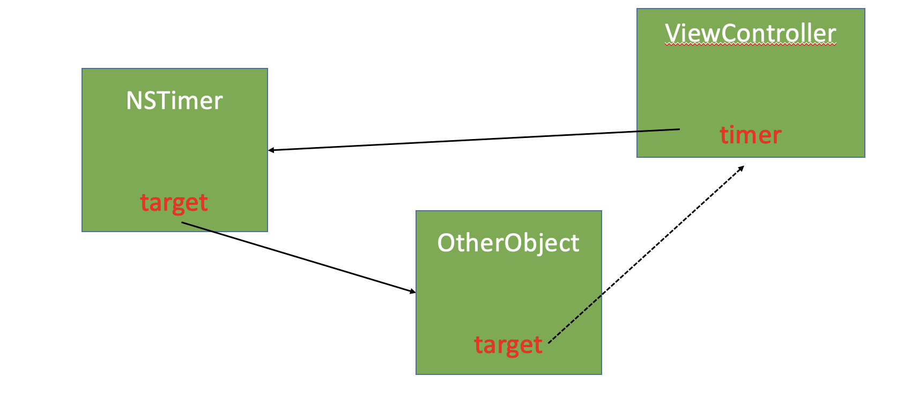

# iOS 中哪些情况会导致循环引用?

- block 中
- delegate 使用 `strong` 
- `NSTimer`

## Block 中的循环引用
由于block在copy时都会对block内部用到的对象进行强引用，比如下面的代码：

```objc

@property (nonatomic, copy) TestBlock testBlock;

self.testObject.testBlock = ^{
   [self doSomething]; 
};
```

由于将 block 作为 self 的属性，self 持有这个 block，同时在block内部访问量 self，在 ARC 下会将 block copy到堆上，由于block在copy时都会对block内部用到的对象进行强引用，所以 block 也持有了 self，就循环引用了。

结局办法：使用 `__weak`

```objc

@property (nonatomic, copy) TestBlock testBlock;

 __weak typeof(self) weakSelf = self;

self.testObject.testBlock = ^{
   [weakSelf doSomething]; 
};
```

## delegate 使用 `strong` 

使用代理的时候，如果用 `strong` , 则该对象强引用 delegate，外界不能销毁 delegate 对象，会导致循环引用。

解决办法，使用 `weak`
```objc
@property (nonatomic, weak) id <MyDelegate> delegate;
```

## `NSTimer` 中的循环引用

由于 `self` 强引用了 `timer`，同时 `timer` 的 `target` 设置成 `self`，则 `timer` 也强引用了 `self`，所以循环引用造成 `dealloc` 方法根本不会走，`self` 和 `timer` 都不会被释放，造成内存泄漏。比如下面的代码：

```objc
@interface ViewController ()

@property (nonatomic, strong) NSTimer *timer;

@end

@implementation ViewController

- (void)viewDidLoad {
    [super viewDidLoad];

    self.timer = [NSTimer scheduledTimerWithTimeInterval:1
                                                  target:self
                                                selector:@selector(timerAction)
                                                userInfo:nil
                                                 repeats:YES];
}

- (void)timerAction {
    NSLog(@"timer log");
}

- (void)dealloc {
    [self.timer invalidate];
    self.timer = nil;
} 

@end
```

### 解决办法

为什么 timer 循环应用中使用 weak 不能解决呢？   
weak 常用在解决的 Block 中的循环引用，对于 timer，将 self 当作参数传入赋值给 target，即使使用的是 weak，实际上访问的还是 self，所以无法解决。

**1.合适的时机释放 timer**

比如在 `viewDidDisappear:` 中手动释放 timer，但是不通用，并且很容易忘记。
```objc
- (void)viewDidDisappear:(BOOL)animated {
    [super viewDidDisappear:animated];
    
    [self.timer invalidate];
    self.timer = nil;
}
```

**2.timer使用 block 方式添加 Target-Action**  
给 `NSTimer` 添加分类，通过 `block` 的方式获取 `action`，实际的 `target` 设置为 `self`，即 `NSTimer` 类。这样在使用 `timer` 时，由于 `target` 的改变，就不再有循环引用了。

其实在 iOS 10 之后，Apple 也提供了以 Block 的方式添加定时器任务的 API，原理是一致的：

```objc
+ (NSTimer *)timerWithTimeInterval:(NSTimeInterval)interval repeats:(BOOL)repeats block:(void (^)(NSTimer *timer))block API_AVAILABLE(macosx(10.12), ios(10.0), watchos(3.0), tvos(10.0));
```

```objc
@implementation NSTimer (BlcokTimer)

+ (NSTimer *)bl_scheduledTimerWithTimeInterval:(NSTimeInterval)interval block:(void (^)(void))block repeats:(BOOL)repeats {
    return [self scheduledTimerWithTimeInterval:interval
                                         target:self
                                       selector:@selector(bl_blockSelector:)
                                       userInfo:[block copy]
                                        repeats:repeats];
}

+ (void)bl_blockSelector:(NSTimer *)timer {
    
    void(^block)(void) = timer.userInfo;
    if (block) {
        block();
    }
}
@end

```

使用中还需要注意block可能引起的循环引用，所以使用weakSelf：

```objc
__weak typeof(self) weakSelf = self;
self.timer = [NSTimer bl_scheduledTimerWithTimeInterval:1 block:^{
     [weakSelf doingSomeThing];
} repeats:YES];
```

**3.给 self 添加中间件 Proxy**  
考虑到循环引用的原因，该方案就是需要打破这些相互引用关系，因此添加一个中间件，弱引用self，同时 timer 引用了中间件，这样通过弱引用来解决了相互引用。
一种方案是直接使用 NSObject 作为一个中间类，更好的方案是使用 NSProxy 来实现，因为 NSProxy 相比于 NSObject 来说，在消息转发上效率更高。具体参见[NSProxy 和 NSObject 的区别？](./answer/foundation/101_ans_ch_1_foundation_01.html#nsproxy-和-nsobject-的区别)



1. 继承自 NSProxy ，实现消息转发的方法

```objc

#import <Foundation/Foundation.h>

@interface MYProxy : NSProxy

@property (weak, nonatomic) id target;

+ (instancetype)proxyWithTarget:(id)target;

@end

#import "MYProxy.h"

@implementation MYProxy

+ (instancetype)proxyWithTarget:(id)target {
    // NSProxy对象不需要调用init，因为它本来就没有init方法
    MYProxy *proxy = [MYProxy alloc];
    proxy.target = target;
    return proxy;
}

- (NSMethodSignature *)methodSignatureForSelector:(SEL)sel {
    return [self.target methodSignatureForSelector:sel];
}

- (void)forwardInvocation:(NSInvocation *)invocation {
    [invocation invokeWithTarget:self.target];
}

@end
```

2. 使用 Timer 的地方传入中间件

```objc
#import "ViewController.h"
#import "MYProxy.h"

@interface ViewController ()

@property (strong, nonatomic) NSTimer *timer;

@end

@implementation ViewController

- (void)viewDidLoad {
    [super viewDidLoad];
    
    self.timer = [NSTimer scheduledTimerWithTimeInterval:1.0
                                                  target:[MYProxy proxyWithTarget:self]
                                                selector:@selector(timerTest)
                                                userInfo:nil
                                                 repeats:YES];
}

- (void)timerTest {
    NSLog(@"%s", __func__);
}

- (void)dealloc {
    NSLog(@"%s", __func__);
    [self.timer invalidate];
}

@end
```

**4. 采用 GCD 定时器**