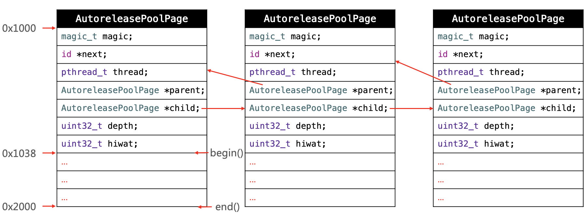

# AutoreleasePool

## 简要说一下 `@autoreleasepool` 的数据结构？

当使用 `@autoreleasepool{}` 来使用一个 AutoreleasePool，随后编译器将其改写成下面的样子：

```objc
void *context = objc_autoreleasePoolPush();

// {}中的代码

objc_autoreleasePoolPop(context);
```

`objc_autoreleasePoolPush()` 和 `objc_autoreleasePoolPop()` 而这两个函数都是对 `AutoreleasePoolPage` 的简单封装，所以自动释放机制的核心就在于这个类:

- `AutoreleasePoolPage` 是一个 C++ 实现的类 , AutoreleasePool 并没有单独的结构，而是由若干个 `AutoreleasePoolPage` 以**双向链表**的形式组合而成（每张链表用 `parent` 指针和 `child` 指针头尾相接）

- AutoreleasePool 是按**线程一一**对应的（结构中的 `thread` 指针指向当前线程）

- `AutoreleasePoolPage` 每个对象会开辟4096字节内存（也就是虚拟内存一页的大小），除了上面的实例变量所占空间，剩下的空间全部用来储存 `autorelease` 对象的地址

- 每创建一个池子，会在首部创建一个 **哨兵** 对象(`POOL_BOUNDARY`), 作为标记，指向栈顶最新 push 进来的 `autorelease` 对象的下一个位置

- 一个 `AutoreleasePoolPage` 的空间被占满时，会新建一个新的 `AutoreleasePoolPage` 对象，池子的顶端的 `next` 指针连接链表，后来的 autorelease 对象在新的 page 加入

- 调用 pop 方法释放 pool 中的对象时，传入一个 `POOL_BOUNDARY` 的内存地址会从最后一个入栈的对象开始发送 `release` 消息，直到遇到这个 `POOL_BOUNDARY`

```c++
class AutoreleasePoolPage  {
    magic_t const magic;
    id *next;
    pthread_t const thread; // 和线程一一对应
    AutoreleasePoolPage * const parent;
    AutoreleasePoolPage *child;
    uint32_t const depth;
    uint32_t hiwat;
}
```
下图中 ... 部分就是用来存放 `autorelease` 对象：


## `@autoreleasepool` 的释放时机？

### autoreleasepool 在主线程上的释放时机

App 启动后，苹果在主线程 RunLoop 里注册了两个 Observer，其回调都是 `_wrapRunLoopWithAutoreleasePoolHandler()`。

- 第一个 Observer 监视的事件是 Entry(即将进入Loop)，其回调内会调用 `_objc_autoreleasePoolPush()` 创建自动释放池。其 order 是 -2147483647，**优先级最高，保证创建释放池发生在其他所有回调之前**。

- 第二个 Observer 监视了两个事件： 
    - BeforeWaiting(准备进入休眠) 时调用 `_objc_autoreleasePoolPop()` 和 `_objc_autoreleasePoolPush()` 释放旧的池并创建新池；
    - Exit(即将退出Loop) 时调用 `_objc_autoreleasePoolPop()` 来释放自动释放池。这个 Observer 的 order 是 2147483647，**优先级最低，保证其释放池子发生在其他所有回调之后**。

在主线程执行的代码，通常是写在诸如事件回调、Timer回调内的。这些回调会被 RunLoop 创建好的 AutoreleasePool 环绕着，所以不会出现内存泄漏，开发者也不必显示创建 Pool 了。

### autoreleasepool 在子线程上的释放时机

首先子线程默认不开启 RunLoop 。但是每一个线程都会维护自己的 Autoreleasepool 对象，所以子线程虽然默认没有开启 RunLoop，但是依然存在AutoreleasePool，在子线程退出的时候会去释放 `autorelease` 对象。
所以，一般情况下，子线程中即使我们不手动添加自动释放池，也不会产生内存泄漏。

## `@autoreleasepool` 与线程、`NSRunLoop` 的关系?

### RunLoop 和 线程 的关系

1. RunLoop 与线程是一一对应关系，每个线程(包括主线程)都有一个对应的RunLoop对象；其对应关系保存在一个全局的 `Dictionary` 里, 线程是 key，runloop 是 value；

2. 主线程的 RunLoop 默认由系统自动创建并启动；而其他线程在创建时并没有 RunLoop，若该线程一直不主动获取，就一直不会有 RunLoop；（懒加载）

3. 苹果不提供直接创建 RunLoop 的方法；所谓其他线程 Runloop 的创建其实是发生在第一次获取的时候，系统判断当前线程没有 RunLoop 就会自动创建；
当前线程结束时，其对应的 Runloop 也被销毁；

### `@autoreleasepool` 和 RunLoop 的关系

App 启动后，苹果在主线程 RunLoop 里注册了两个 Observer，其回调都是 `_wrapRunLoopWithAutoreleasePoolHandler()`。

- 第一个 Observer 监视的事件是 Entry(即将进入Loop)，其回调内会调用 `_objc_autoreleasePoolPush()` 创建自动释放池。其 order 是 -2147483647，**优先级最高，保证创建释放池发生在其他所有回调之前**。

- 第二个 Observer 监视了两个事件： 
    - BeforeWaiting(准备进入休眠) 时调用 `_objc_autoreleasePoolPop()` 和 `_objc_autoreleasePoolPush()` 释放旧的池并创建新池；
    - Exit(即将退出Loop) 时调用 `_objc_autoreleasePoolPop()` 来释放自动释放池。这个 Observer 的 order 是 2147483647，**优先级最低，保证其释放池子发生在其他所有回调之后**。

在主线程执行的代码，通常是写在诸如事件回调、Timer回调内的。这些回调会被 RunLoop 创建好的 AutoreleasePool 环绕着，所以不会出现内存泄漏，开发者也不必显示创建 Pool 了。

### `@autoreleasepool` 和线程的关系

AutoreleasePool 是按线程一一对应的（结构中的 thread 指针指向当前线程）。新的自动释放池被创建的时候，它们会被添加到栈的顶部，而当池子销毁的时候，会从栈移除。对于当前线程来说，Autoreleased对象会被放到栈顶的自动释放池中。当一个线程线程停止，它会自动释放掉与其关联的所有自动释放池。

## 什么场景需要手动添加 `@autoreleasepool` ？
Apple 官方文档[Advanced Memory Management Programming Guide](https://developer.apple.com/library/archive/documentation/Cocoa/Conceptual/MemoryMgmt/Articles/mmAutoreleasePools.html#//apple_ref/doc/uid/20000047)列举了三种需要手动添加 `@autoreleasepool` 的情况

- 编写的不是基于UI框架的程序，例如命令行工具；

- 通过循环方式创建大量临时对象，比如循环创建很多个 image 临时对象
    
    ```objc
    for (int i = 0; i < 1000000; i++) {
        UIImage *img = [[UIImage alloc] init];
        
        // doing something
    }
    ```
    
    `img` 因为离开作用域所以会被加入最近一次创建的自动释放池中，而这个释放池就是主线程上的 RunLoop 管理的；因为for循环在当前线程没有执行完毕。Runloop也就没有完成当前这一次的迭代，所以导致大量对象被延时释放。
    值得注意的是使用容器的block版本的枚举器时，内部会自动添加一个AutoreleasePool：
    
    ```objc
    [array enumerateObjectsUsingBlock:^(id obj, NSUInteger idx, BOOL *stop) {
        // 这里被一个局部@autoreleasepool包围着
    }];
    ```

- 使用非Cocoa程序创建的子线程；

## `autorelease` 对象什么时候释放？

在没有手加 Autorelease Pool的情况下，autorelease 对象是在当前的runloop迭代结束时释放的，而它能够释放的原因是系统在每个runloop迭代中都加入了自动释放池Push和Pop

## 访问 `__weak` 修饰的变量，是否已经被注册在了 `@autoreleasePool` 中？为什么？

答案是肯定的，`__weak` 修饰的变量属于弱引用，如果没有被注册到 `@autoreleasePool` 中，创建之后也就会随之销毁，为了延长它的生命周期，必须注册到 `@autoreleasePool` 中，以延缓释放。

## 为什么已经有了 ARC ,但还是需要 `@autoreleasepool` 的存在？

避免内存峰值，及时释放不需要的内存空间。

## 方法或函数返回一个对象时，会对对象 `autorelease` 么？为什么？

会 ，为了延长返回对象的生命周期，给其他使用者留足调用的时间。