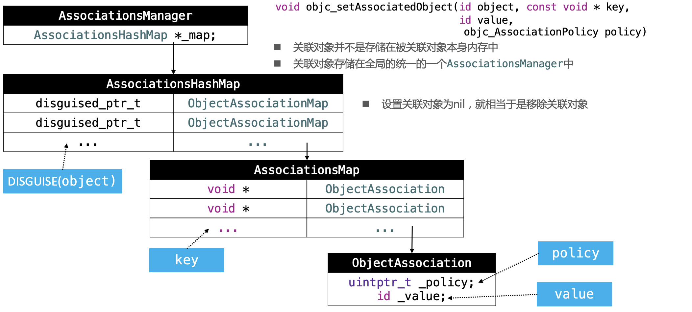

# 关联对象
## 关联对象给分类添加成员变量
关联对象的意思是：将传入的参数和对象进行关联。runtime提供了这三个API实现关联对象：

1.添加关联对象

```objectivec
// object 需要关联的对象，这里是self（自己，就是Person对象）
// key 标识的key
// value 需要关联的值，这里是age
// policy 关联策略 和（assign、copy、retain等类似）这里是使用 OBJC_ASSOCIATION_ASSIGN
void objc_setc(id _Nonnull object, const void * _Nonnull key, id _Nullable value, objc_AssociationPolicy policy)
```

2.获取关联对象：通过对象和key获取

```objectivec
id _Nullable objc_getAssociatedObject(id _Nonnull object, const void * _Nonnull key)
```

3.移除关联对象

```objectivec
void objc_removeAssociatedObjects(id _Nonnull object)
```

比如给Person的分类Person(Test)添加age属性，其代码实现为：
```objc
#import <objc/runtime.h>

static void *MyKey;

@implementation Person (Test)

- (void)setAge:(NSInteger)age {
    objc_setAssociatedObject(self, &MyKey, [NSNumber numberWithInteger:age], OBJC_ASSOCIATION_ASSIGN);
}

- (NSInteger)age {
    return [objc_getAssociatedObject(self, &MyKey) integerValue];
}

@end
```
## 关联对象的底层原理
关联对象通过以下几个核心类实现：
- AssociationsManager：用来管理关联对象
- AssociationsHashMap：key 是 object， value 是 ObjectAssociationMap
- ObjectAssociationMap：key 是 关联对象的 key， value 是 ObjcAssociation
- ObjcAssociation：存储 policy 和关联对象的值 value。



1. 关联对象并不是存储在被关联的对象本身中，而是通过单独的manager中
2. 关联对象的存储结构为：使用两级 map 存储，第一级的key是关联的对象，value是第二级的map，第二级的 key 是关联对象的key，value是封装的关联对象，包含了内存管理策略policy和关联对象的值 value等

### 关联对象的内存管理
对象的 `isa` 指针中有 `has_assoc` 的一个位域，用于标记是否有关联对象。如果该位是1，说明该对象有关联对象，在对象 `dealloc` 的时候会去 AssociationsManager 查找该对象的 AssociationsHashMap，并从内存中抹除。

注意，关联对象的策略中并没有 weak ，策略和修饰符的对应关系：
- OBJC_ASSOCIATION_ASSIGN：`assign`
- OBJC_ASSOCIATION_RETAIN_NONATOMIC：`strong` `nonatomic`
- OBJC_ASSOCIATION_COPY_NONATOMIC: `copy` `nonatomic`
- OBJC_ASSOCIATION_RETAIN:`strong` `atomic`
- OBJC_ASSOCIATION_COPY: `copy` `atomic`

为什么不需要 weak 呢？  
weak修饰的属性，当没有拥有对象之后就会被销毁，并且指针置位nil，那么在对象销毁之后，虽然在map中既然存在值object对应的AssociationsHashMap，但是因为object地址已经被置位nil，会造成坏地址访问而无法根据object对象的地址转化为disguised_object了。


### 关联对象是否是线程安全的？

是线程安全的。AssociationsManager 通过持有一个自旋锁 `spinlock_t` 保证对 AssociationsHashMap 的操作是线程安全的。

```objc
class AssociationsManager {
    static spinlock_t _lock;
    static AssociationsHashMap *_map;
public:
    AssociationsManager()   { _lock.lock(); }
    ~AssociationsManager()  { _lock.unlock(); }

    AssociationsHashMap &associations() {
        if (_map == NULL)
            _map = new AssociationsHashMap();
        return *_map;
    }
};

spinlock_t AssociationsManager::_lock;
AssociationsHashMap *AssociationsManager::_map = NULL;
```

### Apple 为什么不把关联对象实现的成员变量添加到类的结构中去，而是单独的提供一个关联对象 manager 来存储和管理？
内存结构上考虑的，对象的内存结构已经固定了，这个时候再添加成员变量，会破坏内存结构。