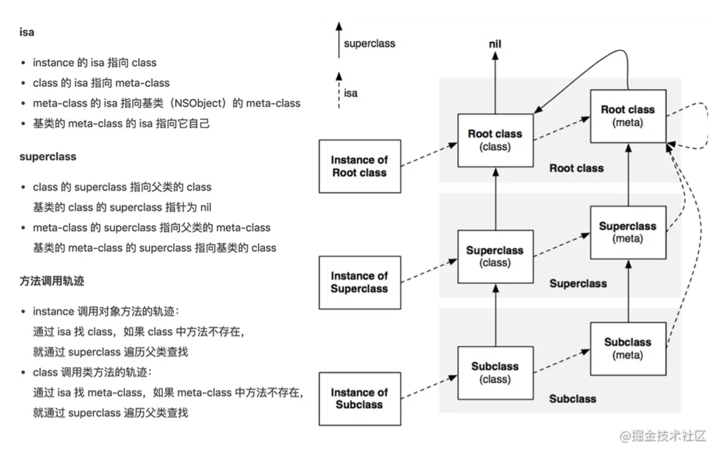
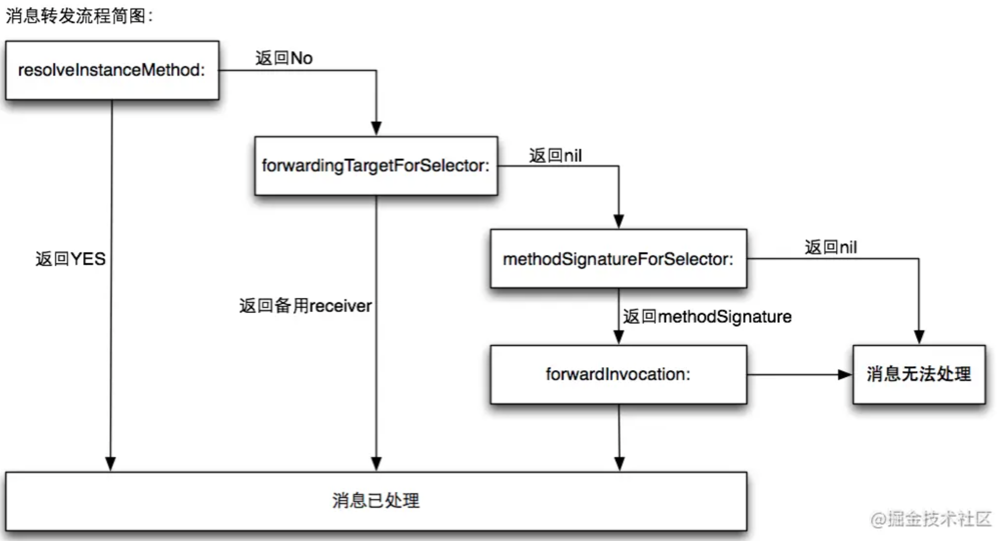

# Runtime 消息发送

## 在 Obj-C 中为什么叫发消息而不叫函数调用？

## Runtime 的方法调用流程

Objetive-C的消息发送，是通过objc_msgSend来实现的，具体执行过程，主要分三个阶段：

1. 消息发送；

2. 动态方法解析

3. 消息转发或重新签名

### 消息发送



### 消息转发
在消息发送阶段会在对应的类的方法列表中搜索方法，如果找不到就会执行消息转发，消息转发的提供了三次机会：
1. **动态方法解析**
2. **备用接收者**
3. **完整的消息转发**



#### 动态方法解析
首先，ObjC 运行时会调用 `+resolveInstanceMethod:`或者 `+resolveClassMethod:`，让你有机会提供一个函数实现。如果你添加了函数并返回YES， 那运行时系统就会重新启动一次消息发送的过程。

实现一个动态方法解析的例子: 虽然 `ViewController` 中没有实现 `eat:` 方法，但是通过 `class_addMethod` 动态添加 `eatMethod` 函数，并执行`eatMethod`这个函数的 `IMP`:

```objc
#import "ViewController.h"
#import <objc/runtime.h>

@interface ViewController ()

@end

@implementation ViewController

- (void)viewDidLoad {
    [super viewDidLoad];
    
    [self performSelector:@selector(eat:)];
}

+ (BOOL)resolveInstanceMethod:(SEL)sel {
    if (sel == @selector(eat:)) {
        class_addMethod([self class], sel, (IMP)eatMethod, "v@:");
        return YES;
    }
    
    return [super resolveInstanceMethod:sel];
}

void eatMethod(id obj, SEL _cmd) {
    NSLog(@"Eating!");
}

@end
```

#### 备用接收者 
如果目标对象实现了 `-forwardingTargetForSelector:`，Runtime 这时就会调用这个方法，给你把这个消息转发给其他对象的机会。

实现一个备用接收者的例子如下：  
1.Person 类作为备用接收者，实现了 `eat` 方法：
```objc
@interface Person : NSObject

@end

@implementation Person

- (void)eat {
    NSLog(@"%@ - %@", [self class], NSStringFromSelector(_cmd));
}

@end
```

2.在 `ViewController` 中通过f `orwardingTargetForSelector` 把当前 `ViewController` 的方法转发给了 `Person` 去执行。
```objc
#import "ViewController.h"
#import <objc/runtime.h>
#import "Person.h"

@interface ViewController ()

@end

@implementation ViewController

- (void)viewDidLoad {
    [super viewDidLoad];
    
    [self performSelector:@selector(eat)];
}

+ (BOOL)resolveInstanceMethod:(SEL)sel {
    return YES;
}

- (id)forwardingTargetForSelector:(SEL)aSelector {
    if (aSelector == @selector(eat)) {
        return [[Person alloc] init];
    }
    
    return [super forwardingTargetForSelector:aSelector];
}

@end
```

#### 完整的消息转发

如果在上一步还不能处理未知消息，则唯一能做的就是启用完整的消息转发机制了：
1. 首先它会发送 `-methodSignatureForSelector:` 消息获得函数的参数和返回值类型
2. 如果 `-methodSignatureForSelector:` 返回nil ，Runtime 则会发出 `-doesNotRecognizeSelector:` 消息，程序这时也就挂掉了
3. 如果返回了一个函数签名，Runtime 就会创建一个 `NSInvocation` 对象并发送 `-forwardInvocation:`消息给目标对象。

```objc
@interface Person : NSObject

@end

@implementation Person

- (void)eat {
    NSLog(@"%@ - %@", [self class], NSStringFromSelector(_cmd));
}

@end
```

Runtime 生成一个 `NSInvocation` 对象，发送给了 forwardInvocation，在 `forwardInvocation` 方法里面让 `Person` 对象去执行 `eat` 方法 :

```objc
#import "ViewController.h"
#import <objc/runtime.h>
#import "Person.h"

@interface ViewController ()

@end

@implementation ViewController

- (void)viewDidLoad {
    [super viewDidLoad];
    
    [self performSelector:@selector(eat)];
}

+ (BOOL)resolveInstanceMethod:(SEL)sel {
    return YES;
}

- (id)forwardingTargetForSelector:(SEL)aSelector {
    return nil;
}

- (NSMethodSignature *)methodSignatureForSelector:(SEL)aSelector {
    if (aSelector == @selector(eat)) {
        // 生成一个 NSMethodSignature 对象，接着会调用 forwardInvocation 方法
        return [NSMethodSignature signatureWithObjCTypes:"v@:"];
    }
    
    return [super methodSignatureForSelector:aSelector];
}

- (void)forwardInvocation:(NSInvocation *)anInvocation {
    SEL selector = anInvocation.selector;
    
    Person *person = [[Person alloc] init];
    if ([person respondsToSelector:selector]) {
        [anInvocation invokeWithTarget:person];
    } else {
        [self doesNotRecognizeSelector:selector];
    }
}

@end
```

## NSMethodSignature 和 NSInvocation
在消息转发的时候会使用到 NSMethodSignature 和 NSInvocation 这两个类：
- NSMethodSignature：**方法签名**，一个对于方法返回值和参数的记录。
- NSInvocation：**把消息呈现为对象形式**。可以存储消息的所有配置和直接调用给任意对象，这就是万物皆对象的一种实践了。这个东西就是苹果工程师提供的一个高层消息转发系统。他是一个命令对象，可以给任意OC对象发送消息，那么与之类似的还有一个performSelector。

### NSMethodSignature

### NSInvocation 

NSInvocation 和 performSelector 对比：
- performSelector：最多接收两个参数，如果参数多余两个 ，就需要组装成字典类型了
- performSelector：参数类型限制为id，如果用普通配型Int Double NSInteger为参数的方法使用时会导致一些诡异的问题

NSInvocation 使用的步骤：
1. 根据 `selector` 来初始化方法签名对象 `NSMethodSignature`
2. 根据方法签名对象来初始化 `NSInvocation` 对象，必须使用 `invocationWithMethodSignature:` 方法
3. 设置默认的 `target` 和 `selector`
4. 设置方法签名对应的参数，从下标2开始，超出签名参数index就越界报错
5. 调用 `NSInvocation` 对象的 `invoke` 方法
6. 若有返回值，使用 `NSInvocation` 的 `getReturnValue` 来获取返回值，注意该方法仅仅就是把返回数据拷贝到提供的内存缓存区，并不会考虑这里的内存管理。

## Runtime 的应用
常见的应用：
- 实现多继承 Multiple Inheritance
- 方法交换 Method Swizzling，比如KVO 实现
- AOP 面向切面编程
- 关联对象(Objective-C Associated Objects)给分类增加属性
- 遍历类的所有成员变量（修改 textfield 的占位文字颜色、字典转模型、自动归档解档）
- 利用消息转发机制解决方法找不到的异常问题
- 消息转发(热更新)解决Bug(JSPatch)


### 如何运用 Runtime 字典转模型

Runtime 遍历 ivar_list,结合 KVC 赋值。

## `_cmd` 关键字的作用？

`_cmd` 在 Objective-C 的方法中表示当前方法的 selector，正如同 `self` 表示当前方法调用的对象实例一样。

### `_cmd`的使用
#### 1.可以使用 `_cmd` 打印当前方法名:
```objc
- (void)viewDidLoad {
    [super viewDidLoad];
    
    NSLog(@"%@ - %@", [self class], NSStringFromSelector(_cmd)); // ViewController - viewDidLoad
}
```

参考：[ObjC中_cmd的用法](https://www.jianshu.com/p/fdb1bc445266)

## `@synthesize` 和 `@dynamic` 关键字的作用？

- `@property` 有两个对应的词，一个是 `@synthesize`，一个是 `@dynamic`。

- 如果 `@synthesize` 和 `@dynamic` 都没写，那么默认的就是 `@syntheszie var = _var`

- `@synthesize` 的语义是如果你没有手动实现 `setter` 方法和 `getter` 方法，那么编译器会自动为你加上这两个方法，同时为属性生成下划线成员变量。

- `@dynamic` 告诉编译器：**属性的 `setter` 与 `getter` 方法由用户自己实现，不自动生成**。（当然对于 readonly 的属性只需提供 getter 即可）。
    假如一个属性被声明为 @dynamic var，然后你没有提供 @setter方法和 @getter 方法，编译的时候没问题，但是当程序运行到 `instance.var = someVar`，由于缺 setter 方法会导致程序崩溃；或者当运行到` someVar = var` 时，由于缺 getter 方法同样会导致崩溃。编译时没问题，运行时才执行相应的方法，这就是所谓的**动态绑定**。

### 使用场景
#### 1.同时重写属性 @property 的 setter 和 getter 方法
使用 @property 指令，编译器会自动生成 setter 和 getter，单独重写 getter或setter，不会出现异常，**但同时重写getter和setter，则会报错**。

原因：**同时重写 getter 和 setter 方法，系统就不会自动生成 `_propertyName` 变量，所以报错**。

解决方案：添加 `@synthesize propertyName = _propertyName`;

```objc
@interface ViewController ()

@property (nonatomic, copy) NSString *name;

@end

@implementation ViewController

@synthesize name = _name; 

- (void)viewDidLoad {
    [super viewDidLoad];

}

- (void)setName:(NSString *)name {
    _name = name;
}

- (NSString *)name {
    if (!_name || _name.length == 0) return @"None Name";
    
    return _name;
}

@end
```

## `isMemberOfClass` 和 `isKindOfClass` 的区别？
- isMemberOfClass方法是判断当前instance/class对象的isa指向是不是class/meta-class对象类型；

- isKindOfClass方法是判断当前instance/class对象的isa指向是不是class/meta-class对象或者它的子类类型。isKindOfClass的范围更大。

# 如何理解OC是一门动态语言
OC的动态特性可从三方面描述:
- **动态类型识别（Dynamic typing）**:最终判定该类的实例类型是在运行期间

- **动态绑定（Dynamic binding）**：在运行时确定调用的方法

- **动态加载（Dynamic loading）**：在运行期间可添加模块（类、方法）

## 动态类型识别 
1. OC中有一个可以表示任何实例对象类型的关键字--id，将对象声明为id类型，可根据需要，赋予不同类型的实例对象。
2. 父类指针同样也可以指向子类实例对象，编译期指针类型为父类，运行后可判断为具体的某个子类。
3. 这段代码也可以很好的解释OC的动态类型识别：NSData *test = [[NSString alloc] init]; 在编译期test被认为NSData类型，运行后则为NSString类型，其值为空字符串("")。

## 动态绑定
消息发送。

## 动态加载
1. 动态添加属性：分类中使用关联对象添加属性

2. 动态添加方法：通过class_addMethod 添加方法

3. 动态添加类：比如KVO

# 参考
- [iOS Runtime详解](https://juejin.cn/post/6844903586216804359)