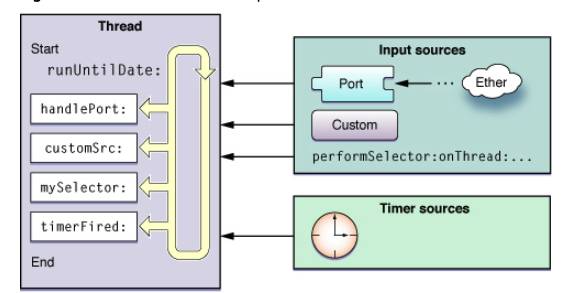

# RunLoop 的概念
RunLoop 实际上就是一个对象，这个对象管理了其需要处理的事件和消息，并提供了一个入口函数来执行事件循环的逻辑。线程执行了这个函数后，就会一直处于这个函数内部 **接受消息->等待->处理**的循环中，直到这个循环结束（比如传入 quit 的消息），函数返回。

OSX/iOS 系统中，提供了两个这样的对象：`NSRunLoop` 和 `CFRunLoopRef`:

- `CFRunLoopRef` 是在 CoreFoundation 框架内的，它提供了纯 C 函数的 API，所有这些 API 都是线程安全的。

- `NSRunLoop` 是基于 `CFRunLoopRef` 的封装，提供了面向对象的 API，但是这些 API 不是线程安全的。

# RunLoop 与线程的关系

1. RunLoop 与线程是一一对应关系，每个线程(包括主线程)都有一个对应的RunLoop对象；其对应关系保存在一个全局的 `Dictionary` 里, 线程是 key，runloop 是 value；

2. 主线程的 RunLoop 默认由系统自动创建并启动；而其他线程在创建时并没有 RunLoop，若该线程一直不主动获取，就一直不会有 RunLoop；（懒加载）

3. 苹果不提供直接创建 RunLoop 的方法；所谓其他线程 Runloop 的创建其实是发生在第一次获取的时候，系统判断当前线程没有 RunLoop 就会自动创建；
当前线程结束时，其对应的 Runloop 也被销毁；

# GCD 在 Runloop 中的使用？
GCD由 子线程 返回到 主线程,只有在这种情况下才会触发 RunLoop。会触发 RunLoop 的 Source 1 事件。

当调用 `dispatch_async(dispatch_get_main_queue(), block) `时，libDispatch 会向主线程的 RunLoop 发送消息，RunLoop 会被唤醒，并从消息中取得这个 block，并在回调 `__CFRUNLOOP_IS_SERVICING_THE_MAIN_DISPATCH_QUEUE__() `里执行这个 block。但这个逻辑仅限于 dispatch 到主线程，dispatch 到其他线程仍然是由 libDispatch 处理的。



# RunLoop 的 mode

Runloop 中一共有5种 mode，其中常用的有3个，其中一个是占位用的：

1. `kCFRunLoopDefaultMode`: App的默认 Mode，通常主线程是在这个 Mode 下运行的。
2. `UITrackingRunLoopMode`: 界面跟踪 Mode，用于 ScrollView 追踪触摸滑动，保证界面滑动时不受其他 Mode 影响。
3. `UIInitializationRunLoopMode`: 在刚启动 App 时第进入的第一个 Mode，启动完成后就不再使用。
4. `GSEventReceiveRunLoopMode`: 接受系统事件的内部 Mode，通常用不到。
5. `kCFRunLoopCommonModes`: 这是一个占位的 Mode，没有实际作用。

一个 RunLoop 包含若干个 Mode，每个 Mode 又包含若干个 Source/Timer/Observer。每次调用 RunLoop 的主函数时，只能指定其中一个 Mode，这个Mode被称作 CurrentMode。如果需要切换 Mode，只能退出 Loop，再重新指定一个 Mode 进入。这样做主要是为了分隔开不同组的 Source/Timer/Observer，让其互不影响。

- CFRunLoopSourceRef 是事件产生的地方。Source有两个版本：Source0 和 Source1。
    - Source0 只包含了一个回调（函数指针），它并不能主动触发事件。使用时，你需要先调用 CFRunLoopSourceSignal(source)，将这个 Source 标记为待处理，然后手动调用 CFRunLoopWakeUp(runloop) 来唤醒 RunLoop，让其处理这个事件。
    - Source1 包含了一个 mach_port 和一个回调（函数指针），被用于通过内核和其他线程相互发送消息。这种 Source 能主动唤醒 RunLoop 的线程。

- CFRunLoopTimerRef 是基于时间的触发器，它和 NSTimer 是toll-free bridged 的，可以混用。其包含一个时间长度和一个回调（函数指针）。当其加入到 RunLoop 时，RunLoop会注册对应的时间点，当时间点到时，RunLoop会被唤醒以执行那个回调。

- CFRunLoopObserverRef 是观察者，每个 Observer 都包含了一个回调（函数指针），当 RunLoop 的状态发生变化时，观察者就能通过回调接受到这个变化。可以观测的时间点有以下几个：

```objc
typedef CF_OPTIONS(CFOptionFlags, CFRunLoopActivity) {
    kCFRunLoopEntry         = (1UL << 0), // 即将进入Loop
    kCFRunLoopBeforeTimers  = (1UL << 1), // 即将处理 Timer
    kCFRunLoopBeforeSources = (1UL << 2), // 即将处理 Source
    kCFRunLoopBeforeWaiting = (1UL << 5), // 即将进入休眠
    kCFRunLoopAfterWaiting  = (1UL << 6), // 刚从休眠中唤醒
    kCFRunLoopExit          = (1UL << 7), // 即将退出Loop
};
```

上面的 Source/Timer/Observer 被统称为 mode item，一个 item 可以被同时加入多个 mode。但一个 item 被重复加入同一个 mode 时是不会有效果的。如果一个 mode 中一个 item 都没有，则 RunLoop 会直接退出，不进入循环。

# RunLoop 的 Observer

如上，每个 RunLoop 中包含若干个 Source/Timer/Observer，个 Observer 都包含了一个回调（函数指针），当 RunLoop 的状态发生变化时，观察者就能通过回调接受到这个变化。可以观测的时间点有以下几个：

```objc
typedef CF_OPTIONS(CFOptionFlags, CFRunLoopActivity) {
    kCFRunLoopEntry         = (1UL << 0), // 即将进入Loop
    kCFRunLoopBeforeTimers  = (1UL << 1), // 即将处理 Timer
    kCFRunLoopBeforeSources = (1UL << 2), // 即将处理 Source
    kCFRunLoopBeforeWaiting = (1UL << 5), // 即将进入休眠
    kCFRunLoopAfterWaiting  = (1UL << 6), // 刚从休眠中唤醒
    kCFRunLoopExit          = (1UL << 7), // 即将退出Loop
};
```

App 启动后，苹果在主线程 RunLoop 里注册了两个 Observer，其回调都是 `_wrapRunLoopWithAutoreleasePoolHandler()`。

- 第一个 Observer 监视的事件是 Entry(即将进入Loop)，其回调内会调用 `_objc_autoreleasePoolPush()` 创建自动释放池。其 order 是 -2147483647，**优先级最高，保证创建释放池发生在其他所有回调之前**。

- 第二个 Observer 监视了两个事件： 
    - BeforeWaiting(准备进入休眠) 时调用 `_objc_autoreleasePoolPop()` 和 `_objc_autoreleasePoolPush()` 释放旧的池并创建新池；
    - Exit(即将退出Loop) 时调用 `_objc_autoreleasePoolPop()` 来释放自动释放池。这个 Observer 的 order 是 2147483647，**优先级最低，保证其释放池子发生在其他所有回调之后**。

在主线程执行的代码，通常是写在诸如事件回调、Timer回调内的。这
些回调会被 RunLoop 创建好的 AutoreleasePool 环绕着，所以不会出现内存泄漏，开发者也不必显示创建 Pool 了。

# RunLoop 的内部逻辑

见下图：


# RunLoop 的应用

Apple 官方给出了4种需要使用 RunLoop 的场景：

- 自定义输入源进行线程通信
- 在子线程上使用 Timer
- 在子线程上使用 `performSelector… `
- 线程保活

## Runloop 在启动上的应用
App 的 LifeCycle 方法是基于 Runloop 的 Source0 的，首帧渲染是基于 Runloop Block 的。Runloop 在启动上主要有几点应用：

- 精准统计启动时间
- 找到一个时机，在启动结束去执行一些预热任务
- 利用 Runloop 打散耗时的启动预热任务

## AFN 中的线程保活
在早起版本的 AFNetworking 中 `AFURLConnectionOperation` 这个类是基于 `NSURLConnection` 构建的，其希望能在后台线程接收 Delegate 回调。为此 AFNetworking 单独创建了一个线程，并在这个线程中启动了一个 RunLoop:

```objc
+ (void)networkRequestThreadEntryPoint:(id)__unused object {
    @autoreleasepool {
        [[NSThread currentThread] setName:@"AFNetworking"];
        NSRunLoop *runLoop = [NSRunLoop currentRunLoop];
        [runLoop addPort:[NSMachPort port] forMode:NSDefaultRunLoopMode];
        [runLoop run];
    }
}
 
+ (NSThread *)networkRequestThread {
    static NSThread *_networkRequestThread = nil;
    static dispatch_once_t oncePredicate;
    dispatch_once(&oncePredicate, ^{
        _networkRequestThread = [[NSThread alloc] initWithTarget:self selector:@selector(networkRequestThreadEntryPoint:) object:nil];
        [_networkRequestThread start];
    });
    return _networkRequestThread;
}
```
Runloop启动前必须要至少一个Timer/Observer/Source,所以AFNetworking在[runLoop run]
之前创建了NSMachPort添加进去了.通常情况下调用者需要持有这个NSMachPort并在外部线程通过这个port发送消息到loop内

```objc
- (void)start {
    [self.lock lock];
    if ([self isCancelled]) {
        [self performSelector:@selector(cancelConnection) onThread:[[self class] networkRequestThread] withObject:nil waitUntilDone:NO modes:[self.runLoopModes allObjects]];
    } else if ([self isReady]) {
        self.state = AFOperationExecutingState;
        [self performSelector:@selector(operationDidStart) onThread:[[self class] networkRequestThread] withObject:nil waitUntilDone:NO modes:[self.runLoopModes allObjects]];
    }
    [self.lock unlock];
}
```
当需要这个后台线程执行任务时,AFNetworking通过调用[NSObject performSelector:onThread:..] 将这个任务扔到了后台线程的 RunLoop 中。

## 卡顿监控

[参考](./../performance/112_ans_ch_12_performance_01.md)

## 性能优化
当tableview的cell有多个ImageView，并且是大图的话，滑动的时候导致卡顿，原因是：**Runloop会在一次循环中绘制屏幕上所有的点，如果加载的图片过大，过多，就会造成需要绘制很多的的点，导致一次循环的时间过长，从而导致UI卡顿。**

参考 [RunLoop性能优化](https://juejin.cn/post/6889769418541252615#heading-12)

# 利用 Runloop 解释一下页面的渲染的过程? 
当我们调用 [UIView setNeedsDisplay] 时，这时会调用当前 View.layer 的 [view.layer setNeedsDisplay]方法。

这等于给当前的 layer 打上了一个脏标记，而此时并没有直接进行绘制工作。而是会到当前的 Runloop 即将休眠，也就是 beforeWaiting 时才会进行绘制工作。

紧接着会调用 [CALayer display]，进入到真正绘制的工作。CALayer 层会判断自己的 delegate 有没有实现异步绘制的代理方法 displayer:，这个代理方法是异步绘制的入口，如果没有实现这个方法，那么会继续进行系统绘制的流程，然后绘制结束。

过程可以用下面这张图来解释：


CALayer 内部会创建一个 Backing Store，用来获取图形上下文。接下来会判断这个 layer 是否有 delegate。

如果有的话，会调用 [layer.delegate drawLayer:inContext:]，并且会返回给我们 [UIView DrawRect:] 的回调，让我们在系统绘制的基础之上再做一些事情。

如果没有 delegate，那么会调用 [CALayer drawInContext:]。

以上两个分支，最终 CALayer 都会将位图提交到 Backing Store，最后提交给 GPU。

至此绘制的过程结束。

# 参考

- [深入理解RunLoop](https://blog.ibireme.com/2015/05/18/runloop/)
- [Apple 官方文档](https://developer.apple.com/library/archive/documentation/Cocoa/Conceptual/Multithreading/RunLoopManagement/RunLoopManagement.html#//apple_ref/doc/uid/10000057i-CH16-SW1)