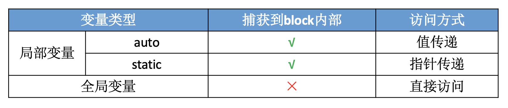
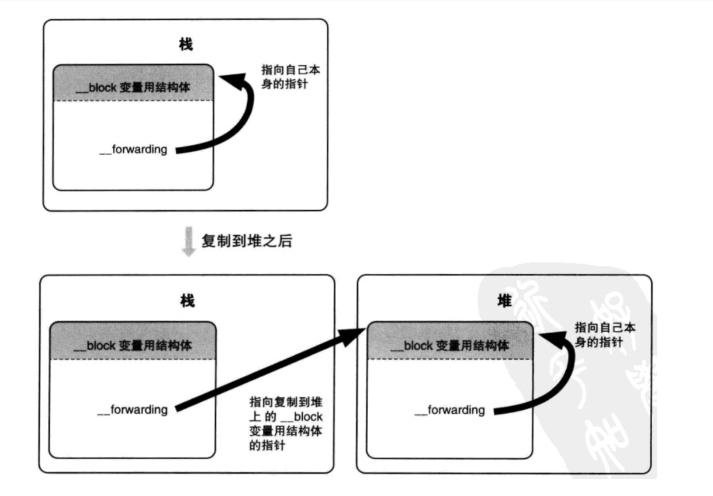

# Block 

## 什么是 block？
Block 被称为带有自动变量（局部变量）的匿名函数，也是一个ObjC对象。底层是基于C的封装。

## block 和 函数指针 的区别?
- 函数指针仅仅是一个地址，不具备函数原型信息，没有类型限制，比如一个指向变量的指针同样可以指向一个函数，但是 block 作为函数对象，是有部分函数信息的，类型限制更明确。

- block 方式便于实现真正的 “函数式” 编程，让函数成为基本的运算元，往更远的方向说，真正的函数式语言可以去掉寄存器(请参考冯诺依曼机器基本架构)，提高程序的执行效率，近段时间的语言都支持 lambda 语法，包括JS、 C++ 、 Python 、 Ruby等，可见各个编程语言为改进冯诺依曼架构做出的努力和准备。

- 提高程序的健壮性， 定义函数的代码会位于程序的代码段，如果函数内部出现内存溢出，就会直接导致 crash，因为代码段是不可写的；block 作为函数对象在运行时生成，位于栈内，即使出现内存溢出，一般也不会直接导致 crash。

## block 有几种类型？每种类型调用 copy 的结果分别是怎样的？

block 有 3 种类型：栈块、堆块、全局块，最终都是继承自 NSBlock 类型。

- `_NSConcreteGlobalBlock`：作为全局变量的 Block, 保存在数据段区（.data 区）。定义在全局区，或者没有访问自动局部变量的block为全局block。
    ```objc
    #include <stdio.h>

    void (^blk)(void) = ^{
	    printf("Gloabl Block\n");
    };

    int main() {
	    return 0;
    }
    ```
- `_NSConcreteStackBlock`：栈上的 Block，保存在栈区。定义 block 的时候，其所占的内存区域是分配在栈中的。block 只在定义它的那个范围内有效。**在ARC下会自动将栈 block copy 到堆**。避免 栈 block 所属的作用域结束后 block 就被废弃。比如如下情况：
  - block 作为函数返回值时
  - 将 block 赋值给 `__strong` 指针时
  - block 作为 Cocoa API 中方法名含有 usingBlock 的方法参数时
  - block 作为 GCD API 的方法参数时

- `_NSConcreteMallocBlock`：堆上的 Block，保存在堆区。给栈block发送 copy 消息后，就会将栈block copy 到堆区。堆块可以在定义它的那个范围之外使用。堆块是带引用计数的对象。由于ARC下会自动将栈 block copy 到堆上，所以不需要我们手动发送 copy 消息。

每一种类型的 block 调用 copy 后的结果：
- `_NSConcreteGlobalBlock`：**什么也不做**

- `_NSConcreteStackBlock`：**从栈复制到堆**

- `_NSConcreteMallocBlock`：**引用计数增加**

## 栈 block 存在什么问题？
在 MRC 下不会自动将栈 block copy 到堆上，比如下面的代码，定义在 if 及 else 中的两个块都分配在栈内存中，当出了 if 及 else 的范围，栈块可能就会被销毁。如果编译器覆写了该块的内存，那么调用该块就会导致程序崩溃。或者数据可能会变成垃圾数据，尽管将来该块还能正常调用，但是它捕获的变量的值已经错乱了。

```objc
void (^block)(void);
if ( /* some condition */ ) {
    block = ^{
        NSLog(@"Block A");
    };
} else {
    block = ^{
        NSLog(@"Block B");
    };
}
block();
```

## block 如何捕获自动变量？
1.**局部变量是 auto 自动变量的情况是值传递**，block内部会有个变量存储auto变量的值;Block在执行语法时，Block中所使用的自动变量值被保存到Block的结构体实例（即Block自身）中。

```objc
int mul = 7;
int (^blk)(int) = ^(int num) {
    return mul * num;
};

// change mul
mul = 10;

int res = blk(3);
NSLog(@"res:%d", res); // res:21 not 30
```

2.**局部变量是 static 静态类型的情况是指针传递**，block 内部会存储静态变量的指针;

```objc
static int mul = 7;
int (^blk)(int) = ^(int num) {
    return mul * num;
};

// change mul
mul = 10;

int res = blk(3);
NSLog(@"res:%d", res); // res:21 not 30
```

3.**全局变量直接访问**



## block 捕获对象类型的 auto 变量
当 block 内部访问了对象类型的 auto 变量时，有两种情况：
- 如果 block 是在栈上，将不会对 auto 变量产生强引用

- 如果 block 被拷贝到堆上：会调用 block 内部的 `copy` `函数，copy` 函数内部会调用 `_Block_object_assign` 函数，`_Block_object_assign` 函数会根据auto 变量的修饰符（`__strong`、`__weak`、`__unsafe_unretained`）做出相应的操作，形成强引用（retain）或者弱引用

- 如果 block 从堆上移除: 会调用 block 内部的 `dispose` 函数, `dispose` 函数内部会调用 `_Block_object_dispose` 函数, `_Block_object_dispose` 函数会自动释放引用的 auto 变量（release）


## `__block` 

### `__block` 的作用？
换个问法：`__block `修饰的变量是怎么做到可以在不同block内进行修改？

Block能捕获自动变量值，但是却不能对其进行修改。如果要对值进行修改，需要使用 `__block`修饰变量。 `__block` 可以用于解决block内部无法修改auto变量值的问题，需要注意的是 `__block` 不能修饰全局变量、静态变量（static）。**使用 `__block` 修饰变量后，编译器会将 `__block` 变量包装成一个对象**。然后通过 `forwarding` 指针拿到这个变量进行修改。

### block 结构里的 `forwarding` 指针的作用？

将 `__block` 变量从栈复制到堆后，改变指向，从而指向真实且唯一的存储实际变量的结构体。
对于堆上的 block 的访问，就是通过 `forwarding` 实现的：block 变量用结构体成员变量 `forwarding` 实现无论 block 变量配置在栈还是在堆上都能正确的访问 block 变量。当 block 变量配置在堆上时，只要栈上的结构体成员变量 `forwarding` 指向堆上的结构体实例，那么不管是从栈上还是从堆上的 `__block` 变量都能正确访问。

